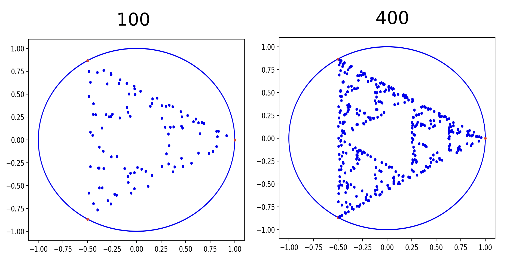
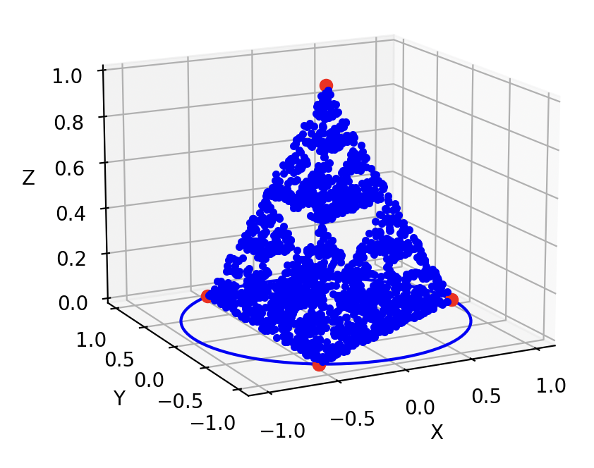

# Fractal Exploration: Sierpinski Triangle

This repository explores the fascinating world of fractals, specifically focusing on the creation of the **Sierpinski Triangle** using uniform distribution and random sampling techniques. The Sierpinski Triangle is a self-similar fractal that reveals an intricate pattern emerging from simple rules and repetitions.

## Fractal Generation

### 2D Sierpinski Triangle
The 2d fractal over iterations.

### 3D Sierpinski Tetrahedron
The 3d fractal:

## Implementation Details

- The project is implemented in Python, making use of:
  - **NumPy** for efficient mathematical operations and random sampling.
  - **Matplotlib** for plotting the 2D fractal.
  - **Plotly** or **Mayavi** for visualizing the 3D fractal.

The code is structured into separate scripts for generating the 2D and 3D fractals, with options to adjust parameters such as the number of iterations and the position of vertices.
